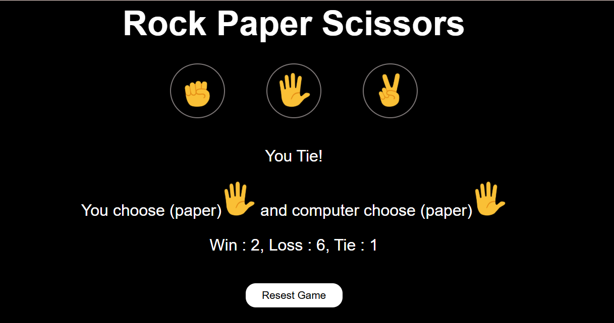

# Rock Paper Scissors 🎮

A simple and interactive **Rock-Paper-Scissors-Game** built with **HTML, CSS, and JavaScript**.  
The game includes score tracking, auto-play mode, reset confirmation, and keyboard shortcuts for an engaging experience.  

---

## 🚀 Demo
Play the live version here:  
👉 [Rock Paper Scissors Demo][https://sayyedhassanbacha-shb.github.io/Rock-Paper-Scissors-Game/](https://sayyedhassanbacha-shb.github.io/Rock-Paper-Scissors-Game/)

---

## 📸 Screenshot


---

## ✨ Features
- Play **Rock, Paper, Scissors** against the computer  
- Persistent **score tracking** using localStorage  
- **Reset game** with confirmation popup  
- **Auto Play mode** – computer plays automatically until stopped  
- **Keyboard Shortcuts**:  
  - `R` → Rock  
  - `P` → Paper  
  - `S` → Scissors  
  - `A` → Toggle Auto Play  
  - `Backspace` → Open Reset Confirmation  
  - `Y` / `N` → Confirm or Cancel reset  

---

## 🛠️ Technologies
- **HTML5** – structure  
- **CSS3** – responsive design (dark theme, flexbox layout)  
- **JavaScript (ES6)** – game logic, interactivity, localStorage  

---

## 📂 Project Structure
Rock-Paper-Scissors/                    
│── assets/ # Game images and screenshot                             
│── src/                       
│ ├── style.css # Styling                        
│ └── script.js # Game logic                        
|── index.html # Main UI                    
│── .gitignore                    
│── LICENSE                  
│── README.md                     

---

## ⚡ Getting Started

### 1. Clone the Repository
```bash
git clone https://github.com/YOUR-USERNAME/Rock-Paper-Scissors.git
cd Rock-Paper-Scissors/src

### 2. Run the Game
Open index.html in your browser to start playing.
```

----

## 📜 License
- This project is licensed under the [MIT License](LICENSE).

---

